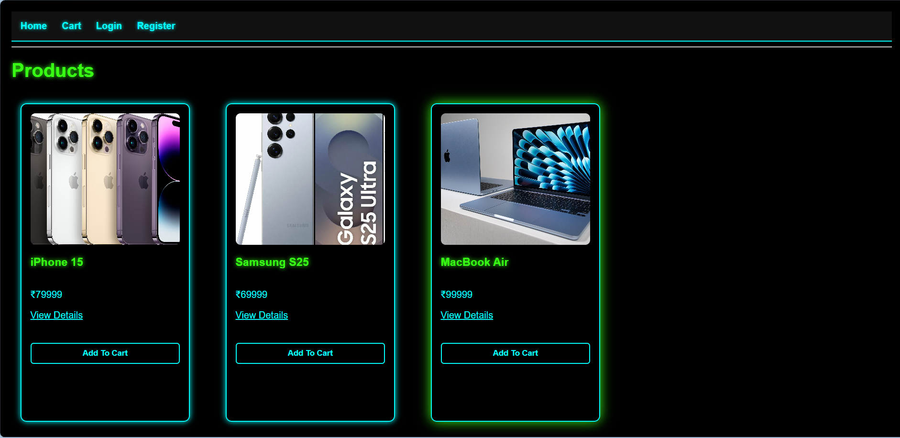
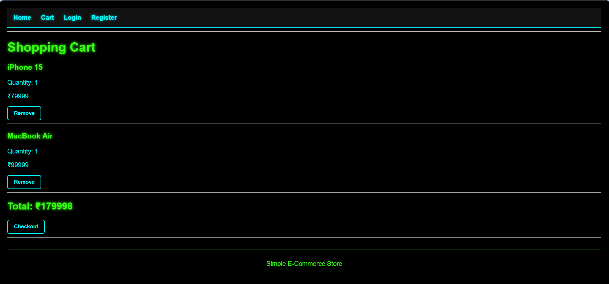

# CodeAlpha E-Commerce Store

A full-stack E-Commerce Store built using:

## Tech Stack

- HTML
- CSS
- JavaScript
- Node.js
- Express.js
- MongoDB

## Features

- Product Listings
- Product Details Page
- Shopping Cart
- User Registration/Login
- JWT Authentication
- Order Processing
- MongoDB Database Storage

## Home Page



Home Page – Product listing page displaying available products with images, prices, and Add to Cart functionality.


## Shopping Cart



Shopping Cart – Displays selected products, quantities, and total order amount before checkout.

## Run Locally

```bash
npm install
npm start
```

Server runs at:

```text
http://localhost:5000
```
